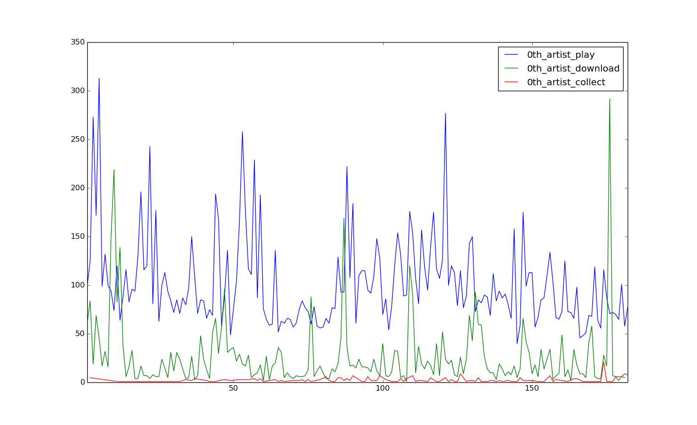
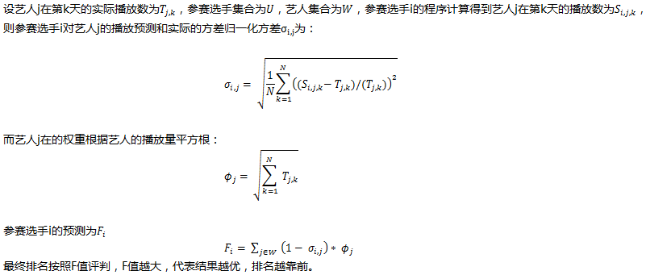
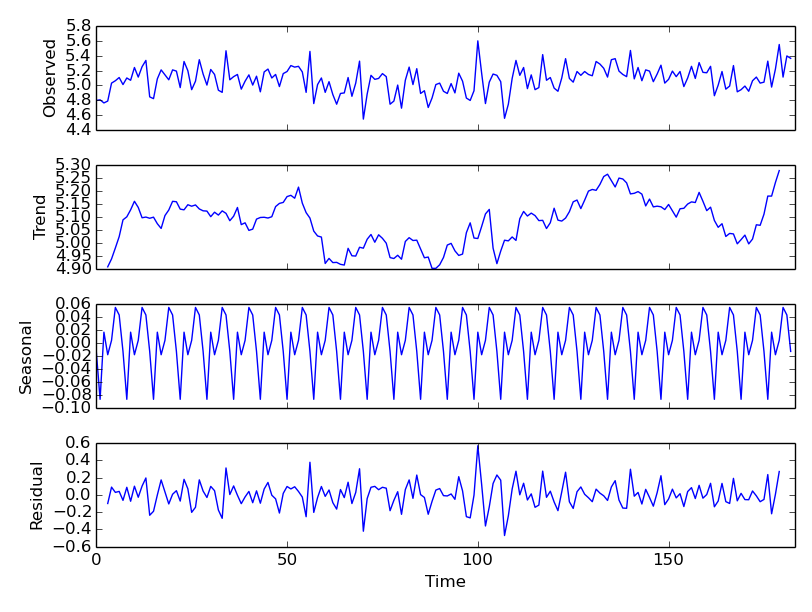
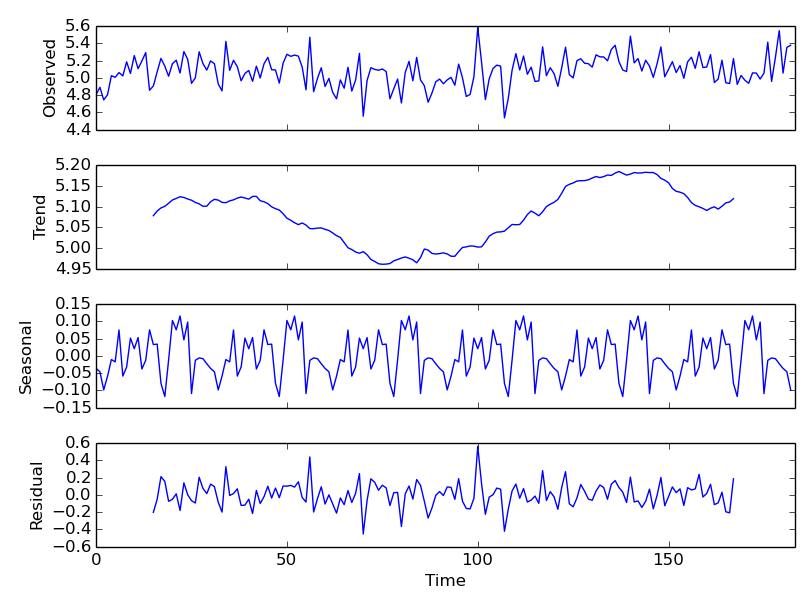
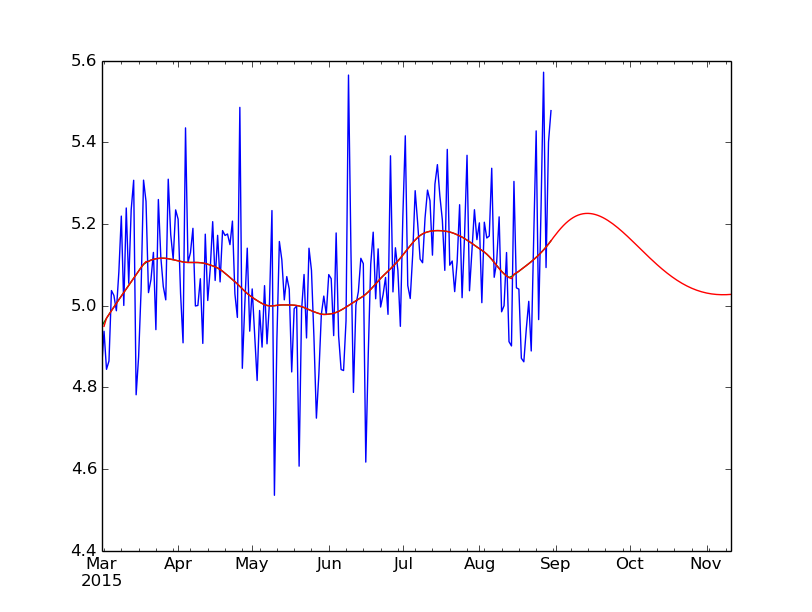
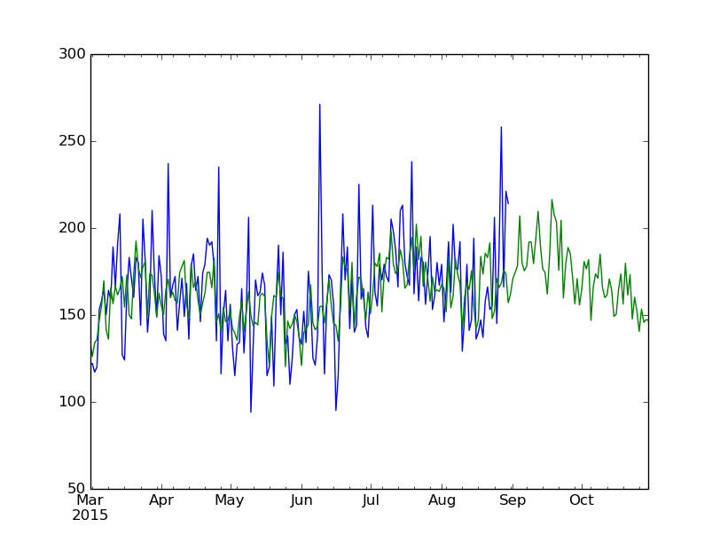
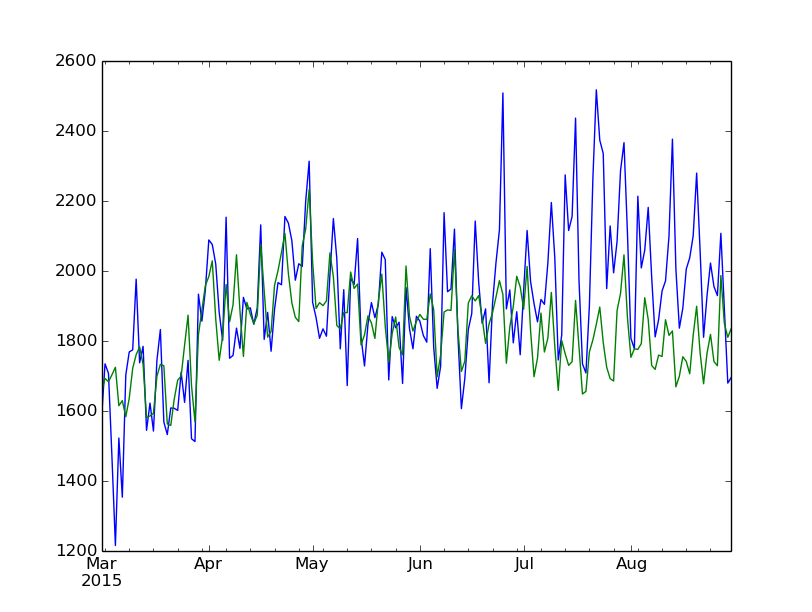
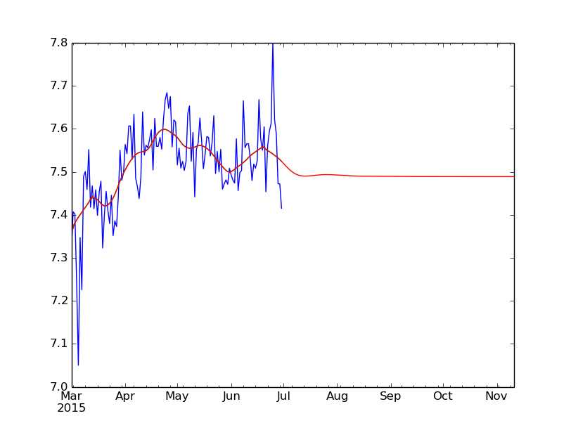
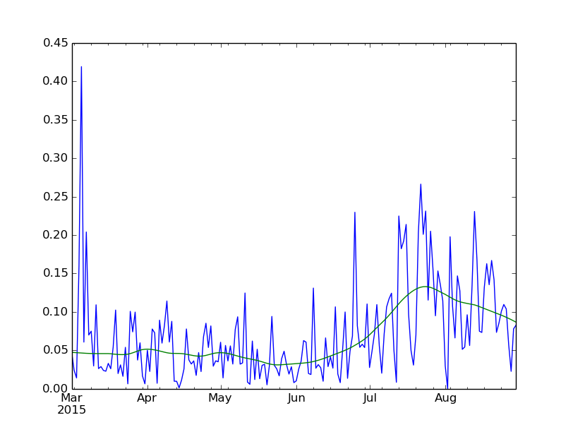

# 时间序列模型的试用——阿里音乐流行趋势预测大赛
https://tianchi.shuju.aliyun.com

## 文件说明
第一季比赛前后共两个数据。第一个数据集预测50个歌手的歌曲播放量，使用的程序在文件夹`s1d1`中；第二个数据集预测100个歌手的歌曲播放量，使用的代码在文件夹`s1d2`中。
* 第一个数据集合的下载链接：https://pan.baidu.com/s/1i4ORGjF
* 第二个数据集合的下载链接：https://pan.baidu.com/s/1hrF0sok

# 第一个数据集（50个歌手），文件夹`s1d1`
## 依赖的运行环境
* Ubuntu
* python 2.7
* 可以安装pip，然后用pip安装python的libs
* ipython （python开发环境）
* matplotlib (用来画图表)
* numpy (用来作数据处理)
* pandas (用来作数据处理)
* scikit-learn （用来作学习) [安装方法](http://www.bogotobogo.com/python/scikit-learn/scikit-learn_install.php)  

## data文件夹
mars_tianchi_songs.csv、mars_tianchi_user_actions.csv两个数据文件
* 下载链接：https://pan.baidu.com/s/1i4ORGjF
* 下载两个数据文件，放到文件`data`里面，zip文件需要解压得到csv文件

## 运行ipython
在shell下面运行ipython
```
ipython --pylab
```

## pp.py
数据预处理和统计部分的代码
在ipython里面输入
```
%run pp.py
```
开始进行数据预处理和统计

#### 输出
```
===start generate date rank==================================
#从20150301到20151031共245天
date num  245
#日期的编号
rank to date : {0: '20150301', 1: '20150302', 2: '20150303', 3: '20150304', 4: '20150305', 5: '20150306', 6: '20150307', 7: '20150308', 8: '20150309', 9: '20150310', 10: '20150311', 11: '20150312', 12: '20150313', 13: '20150314', 14: '20150315', 15: '20150316', 16: '20150317', 17: '20150318', 18: '20150319', 19: '20150320', 20: '20150321', 21: '20150322', 22: '20150323', 23: '20150324', 24: '20150325', 25: '20150326', 26: '20150327', 27: '20150328', 28: '20150329', 29: '20150330', 30: '20150331', 31: '20150401', 32: '20150402', 33: '20150403', 34: '20150404', 35: '20150405', 36: '20150406', 37: '20150407', 38: '20150408', 39: '20150409', 40: '20150410', 41: '20150411', 42: '20150412', 43: '20150413', 44: '20150414', 45: '20150415', 46: '20150416', 47: '20150417', 48: '20150418', 49: '20150419', 50: '20150420', 51: '20150421', 52: '20150422', 53: '20150423', 54: '20150424', 55: '20150425', 56: '20150426', 57: '20150427', 58: '20150428', 59: '20150429', 60: '20150430', 61: '20150501', 62: '20150502', 63: '20150503', 64: '20150504', 65: '20150505', 66: '20150506', 67: '20150507', 68: '20150508', 69: '20150509', 70: '20150510', 71: '20150511', 72: '20150512', 73: '20150513', 74: '20150514', 75: '20150515', 76: '20150516', 77: '20150517', 78: '20150518', 79: '20150519', 80: '20150520', 81: '20150521', 82: '20150522', 83: '20150523', 84: '20150524', 85: '20150525', 86: '20150526', 87: '20150527', 88: '20150528', 89: '20150529', 90: '20150530', 91: '20150531', 92: '20150601', 93: '20150602', 94: '20150603', 95: '20150604', 96: '20150605', 97: '20150606', 98: '20150607', 99: '20150608', 100: '20150609', 101: '20150610', 102: '20150611', 103: '20150612', 104: '20150613', 105: '20150614', 106: '20150615', 107: '20150616', 108: '20150617', 109: '20150618', 110: '20150619', 111: '20150620', 112: '20150621', 113: '20150622', 114: '20150623', 115: '20150624', 116: '20150625', 117: '20150626', 118: '20150627', 119: '20150628', 120: '20150629', 121: '20150630', 122: '20150701', 123: '20150702', 124: '20150703', 125: '20150704', 126: '20150705', 127: '20150706', 128: '20150707', 129: '20150708', 130: '20150709', 131: '20150710', 132: '20150711', 133: '20150712', 134: '20150713', 135: '20150714', 136: '20150715', 137: '20150716', 138: '20150717', 139: '20150718', 140: '20150719', 141: '20150720', 142: '20150721', 143: '20150722', 144: '20150723', 145: '20150724', 146: '20150725', 147: '20150726', 148: '20150727', 149: '20150728', 150: '20150729', 151: '20150730', 152: '20150731', 153: '20150801', 154: '20150802', 155: '20150803', 156: '20150804', 157: '20150805', 158: '20150806', 159: '20150807', 160: '20150808', 161: '20150809', 162: '20150810', 163: '20150811', 164: '20150812', 165: '20150813', 166: '20150814', 167: '20150815', 168: '20150816', 169: '20150817', 170: '20150818', 171: '20150819', 172: '20150820', 173: '20150821', 174: '20150822', 175: '20150823', 176: '20150824', 177: '20150825', 178: '20150826', 179: '20150827', 180: '20150828', 181: '20150829', 182: '20150830', 183: '20150831', 184: '20150901', 185: '20150902', 186: '20150903', 187: '20150904', 188: '20150905', 189: '20150906', 190: '20150907', 191: '20150908', 192: '20150909', 193: '20150910', 194: '20150911', 195: '20150912', 196: '20150913', 197: '20150914', 198: '20150915', 199: '20150916', 200: '20150917', 201: '20150918', 202: '20150919', 203: '20150920', 204: '20150921', 205: '20150922', 206: '20150923', 207: '20150924', 208: '20150925', 209: '20150926', 210: '20150927', 211: '20150928', 212: '20150929', 213: '20150930', 214: '20151001', 215: '20151002', 216: '20151003', 217: '20151004', 218: '20151005', 219: '20151006', 220: '20151007', 221: '20151008', 222: '20151009', 223: '20151010', 224: '20151011', 225: '20151012', 226: '20151013', 227: '20151014', 228: '20151015', 229: '20151016', 230: '20151017', 231: '20151018', 232: '20151019', 233: '20151020', 234: '20151021', 235: '20151022', 236: '20151023', 237: '20151024', 238: '20151025', 239: '20151026', 240: '20151027', 241: '20151028', 242: '20151029', 243: '20151030', 244: '20151031'}
===end generate date rank==================================

===start load songs==================================
# 歌曲的数量
songs num  10842
songs_id_to_songinfo num  10842
# 歌手的数量
artist num  50
# 语言类型的数量
language type num  9
# 歌手的性别类型（男、女、乐队）
artist gender num  3
# 编号为k的歌手出的歌曲的数量
k th artist songs num  {0: 579, 1: 310, 2: 97, 3: 50, 4: 84, 5: 291, 6: 16, 7: 313, 8: 110, 9: 50, 10: 28, 11: 172, 12: 118, 13: 22, 14: 685, 15: 322, 16: 722, 17: 112, 18: 55, 19: 243, 20: 38, 21: 154, 22: 1861, 23: 146, 24: 11, 25: 134, 26: 180, 27: 150, 28: 124, 29: 89, 30: 117, 31: 86, 32: 38, 33: 621, 34: 67, 35: 152, 36: 60, 37: 57, 38: 12, 39: 176, 40: 675, 41: 203, 42: 568, 43: 274, 44: 25, 45: 197, 46: 75, 47: 10, 48: 44, 49: 119}
It takes 0.094105 s to load songs
===end load songs===================================

===start user statistics==================================
# 用户的数量
user num 349946
# 被播放的、下载过的、收藏过的歌曲的数量
song num that has action 10278
# 用户行为的数量：播放、下载、收藏
action type num 3
It takes 17.047225 s to do user statistics
===end user statistics===================================

===start action statistics==================================
# 运行更多的统计
It takes 138.617669 s to do action statistics
===end actions statistics===================================
```
### 画图
* plotJA(j)，显示第j个歌手的播放量、下载量、收藏量
```
plotJA(0)
```
得到的结果如图


* plotJS(j)，显示第j首歌的播放量、下载量、收藏量
```
plotJS(0)
```
得到的结果如图


## le.py
学习和测试部分的代码
* 在ipython里面，运行学习和测试部分的代码（pp.py会被le.py调用运行)
```
%run le.py
```
* 运行fitJU(j)，对第j个user的播放量用多项式进行拟合并画图
```
fitJU(0)
```
得到的结果如图


## test(degree)
`test(degree)`函数用前４个月的播放量预测后两个月的播放量，拿预测值和真值比较，计算出总体的Ｆ值，实现了如下图的F值计算公式




# 第二个数据集（100个歌手），文件夹`s1d2`
## data文件夹
`p2_mars_tianchi_songs.csv`、`p2_mars_tianchi_user_actions.csv`两个数据文件
* 下载链接：https://pan.baidu.com/s/1hrF0sok
* 下载两个数据文件，放到文件`data`里面，zip文件需要解压得到csv文件

## 程序
* pp2.py是数据的预处理和统计部分
 * 将两个数据文件放在data文件夹下，然后在ipython里面直接运行这个脚本就可能得到数据预处理的结果
 * 主要统计了歌曲、用户、歌手的一些数据，相对于s1d1里面的`pp.py`，统计的数据做了简化，只计算出了每个歌手每天的播放次数，因为后面使用的模型只使用了歌手的播放量这个数据
 * 运行后的输出：

```
date num  244
songs num  26958
songs_id_to_songinfo num  26958
artist num  100
language type num  9
artist gender num  3
user num 536024
song num that has action 24943
action type num 3
```

* le2.py是机器学习的部分
 * 给每个歌手的播放量训练一个模型
 * 函数`APtoDF()`将每个歌手每天的播放量存到`pandas.DataFrame`里面
 * 因为播放量数据经常出现暴增和递减的波动，对播放量取log得到的数据进行学习
 * 函数`stl()`使用`tsa.seasonal_decompos`分解出了数据的周期波动，包括周波动、月波动，用`statsmodels`的`tsa.arima_model`对去掉了周波动和月波动之后得到的趋势做拟合，并画图，在拟合之前，先用`nonparametric.lowess`对趋势数据进行了平滑处理
 * 用`nonparametric.lowess`对趋势数据进行了平滑处理时，存在一个参数`frac`，`frac`越大，数据越平滑，经过调参，发现frac=0.2是个比较好的结果，去掉了短期的波动，能够反映出数据的趋势
 * 但是frac比较大时，`tsa.arima_model`有时会得不到结果，所以就设置了递减的多个frac让`tsa.arima_model`去尝试
 * 运行`stl(98)`表示对第98个歌手进行学习（从0开始编号），得到每周的周期性波动（Seasonal部分），每月的周期性波动（Seasonal部分），去掉周周期、月周期波动后的趋势的（蓝色线），以及平滑和预测（红色线）原始的播放量（蓝色线）和播放量的预测（绿色线），
 * 运行`predstl()`，将对100个歌手未来60天的播放量进行预测，并将预测结果存在`data`文件夹下的`mars_tianchi_artistst_plays_predict.csv`中，每个歌手的播放量的训练数据和预测的结果图片存在`pic_pred_3`文件夹下
 * 运行`stlTest(34)`，将对第34个歌手的播放量，用提供的６个月的数据的前４个月作为训练集，后２个月作为测试集，得到的播放量的情况，蓝色线是真实的播放量，3、４、５、６月的绿色曲线是模型用训练集拟合的曲线，7、8月的绿色曲线是模型预测的播放量，可以看出，对波动的预测效果还不错，但是对趋势预测效果不太好，对播放量的log的趋势拟合和预测，可以看出趋势的预测并不好，对7、8月的播放量的预测，误差比（误差的绝对值除以真实值）大约10%，需要对趋势的预测做优化。

# 比赛
第一个数据集5月17日发布，提交了三次结果，最好成绩是６月６日的结果，分数6018，在5476支参赛队伍中排名731。排名第1的约6500分，排名第500的约6300分
 * 2016-06-06 20:46:07， 6017.99687173分， 总排名731
 * 2016-06-05 16:16:13， 5679.55280239分， 总排名927
 * 2016-06-02 18:36:04， 4538.64863527分， 总排名970

第二个数据集合6月7日发布，提交了一次结果，最好成绩是６月14日的结果，分数13959，在5476支参赛队伍中排名613。排名第1的约15500分，排名第500的约14600分。
 * 2016-06-14 05:13:05， 13958.78122696分，总排名613

第一赛季6月14日上午十点结束，使用第二个数据集的最高分数的提交排名，排名前500的可以进入复赛，所以没有进入复赛。

# 感受
* 多投入时间。一个赛季约一个月的时间，因为取的是最高成绩，所以最好每天都做写改动，提交一个结果。我做这个比赛开始时不太有思路，因为不是典型的分类、聚类问题，而是时间序列问题，所以上手有点慢，时间不是很够，第二个模型的结果只提交了一次，为了得到更好的结果，就提交了一个有点冒险的结果，没有时间试试那个比较保守的预测方式，可能保守的预测实际上效果是更好的。
* 多交流。加一些讨论群，看看别人的思路。刚开始的时候很容易不太有思路，听听别人的方法能帮助你快速进入状态。我开始自己在那儿琢磨，第三周才出来一个模型，用的也是最直接的回归模型，后来在比赛的论坛里听说分类、聚类的思路是有人不少人用的，而且效果也很好，而我认为这个时间序列问题是没有办法拿分类、聚类的思路来做的。
* 看看往期的比赛总结。比如[阿里天池里面的学习视频](https://tianchi.shuju.aliyun.com/video.htm?spm=5176.100150.12345.7.4kwxBp)很不错，有之前冠军队伍的答辩视频，很有参看价值。
* 试验多个模型、调调参数。基本的统计做完后，基本就是建模、调参、处理特殊情况了。我６月６日的模型是在６月５号的一个模型的基础上改的，就是切分了一下数据集，分数提升还是挺明显的。
* 做数据挖掘的问题，先要找到一个主要的模型来初步解决问题，然后不断补充模型，选择模型和补充模型主要是要考虑现在哪些地方可以解决和优化。我做这个比赛主要考虑的思路就是对时间序列做回归，然后要分解出序列的周期性和趋势，然后对趋势做回归。
* 机器学习、统计的方法有很多，就做比赛而言，对于算法的掌握很主要的一点是知道这个算法适用的问题，然后是使用合适的库文件去把模型跑起来，因为对性能没有很高的要求，所以对算法的原理和实现要求不高，但是在参数调节时，需要理解模型参数的含义。
* 对问题的理解很重要，一方面要从数据中找到能够解决问题的特征和统计数据，另一方面可以从模型的中间结果、模型的误差去推测数据的意义。比如时间序列中存在周期性的波动，有些是周波动，有些是月波动。通过做模型也能够加强你对问题的理解。
* 向有经验的朋友请教，跟他们合作。一个人可能走得快，但是和朋友一起可以走得远。比赛的两周时间里，在一点资讯做推荐系统的wangxiaoshu学长、在读书会认识的tengweiliang大哥、在北师学习统计的huangxin同学、在快手的lisengdong栋哥在模型方面给了我宝贵的建议和指导，时间仓促，要是能够更多讨论，收获会大很多

# 致谢
感谢在一点资讯做推荐系统的wangxiaoshu学长、在软件所读书会认识的tengweiliang大哥、在北师学习统计的huangxin同学、在快手的lisengdong栋哥，他们给了我宝贵的建议和指导
